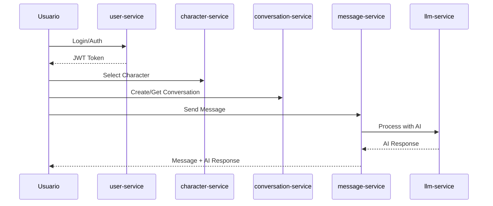

# Análisis de Integración de Microservicios

*Análisis completo de la arquitectura de microservicios del proyecto Character Chat API*

## Resumen Ejecutivo

Después de analizar todos los microservicios del ecosistema, la arquitectura presenta bases sólidas pero sufre de implementación inconsistente y falta de coordinación entre servicios. Es funcional para desarrollo pero requiere mejoras significativas para ser robusta y escalable en producción.

**Evaluación General: 6/10**

## Arquitectura General

### Microservicios Analizados

| Servicio | Puerto | Base de Datos | Propósito | Nivel de Madurez |
|----------|--------|---------------|-----------|------------------|
| **user-service** | 8024 | PostgreSQL | JWT authentication, gestión usuarios, sistema de créditos | Básico |
| **character-service** | 8020 | PostgreSQL | CRUD personajes, metadata, cache en memoria | Avanzado |
| **conversation-service** | 8003 | MongoDB | Gestión conversaciones, middleware auth avanzado | Muy Avanzado |
| **message-service** | 9 | MongoDB + Redis | Procesamiento mensajes, integración LLM, analytics | Avanzado |
| **llm-service** | 8022 | N/A | Wrapper API para LM Studio, modelos IA | Básico |

## Fortalezas de la Integración ✅

### 1. Arquitectura Bien Estructurada
- **Separación clara de responsabilidades** por dominio de negocio
- **Patrón consistente de 3 capas** (API, Service, Repository) en la mayoría de servicios
- **Uso uniforme de FastAPI** con patrones async/await para escalabilidad
- **Modelos Pydantic** para validación de datos consistente

### 2. Seguridad Centralizada
- **JWT authentication centralizada** en user-service
- **Validación distribuida** de tokens en otros servicios
- **Middleware de autenticación** robusto en conversation-service
- **Patrones de autorización** con roles y permisos implementados
- **Hashing seguro** de contraseñas con bcrypt

### 3. Patrones de Integración Robustos
- **Circuit breakers** en conversation-service para tolerancia a fallos
- **HTTP clients async** con retry logic y timeouts configurables
- **Health checks integrales** con verificación de dependencias
- **Manejo de excepciones** personalizado por dominio
- **Logging estructurado** con correlation IDs

### 4. Tecnologías Apropiadas
- **FastAPI** para APIs de alto rendimiento
- **MongoDB** para datos no estructurados (conversaciones, mensajes)
- **PostgreSQL** para datos estructurados (usuarios, personajes)
- **Redis** para cache y colas de procesamiento
- **Beanie ODM** para operaciones MongoDB async

## Problemas Críticos de Integración ⚠️

### 1. Inconsistencias en Arquitectura

```
user-service:         Estructura simple, sin patrones avanzados
character-service:    Arquitectura completa con repositorios y cache
conversation-service: Middleware avanzado con circuit breakers  
message-service:      Integración LLM compleja con workers
llm-service:          Wrapper simple de LM Studio
```

**Impacto:** Diferentes niveles de robustez y mantenibilidad entre servicios.

### 2. Comunicación Inter-Servicios Incompleta

**Problemas identificados:**
- Solo conversation-service implementa clients HTTP para otros servicios
- message-service no valida que las conversaciones existan antes de procesar
- character-service no verifica ownership de usuarios
- Falta coordinación entre message-service y conversation-service para estadísticas
- No hay propagación de eventos entre servicios

**Ejemplo de problema:**
```python
# message-service puede procesar mensajes para conversaciones inexistentes
# porque no valida con conversation-service
```

### 3. Gestión de Datos Fragmentada

```
Base de Datos por Servicio:
├── PostgreSQL: user-service, character-service
├── MongoDB: conversation-service, message-service  
└── Redis: Solo message-service
```

**Problemas críticos:**
- **Sin transacciones distribuidas** para operaciones que abarcan múltiples servicios
- **Riesgo de inconsistencia** de datos entre servicios
- **Falta de patrones** saga o event sourcing para consistencia eventual
- **Diferentes esquemas** de timestamps y IDs entre servicios

### 4. Configuración Inconsistente

**Problemas de configuración:**
- URLs de servicios hardcodeadas (`localhost`) no configurables por ambiente
- Diferentes estrategias de configuración por servicio
- Puertos fijos sin service discovery
- Falta de configuración centralizada

**Ejemplo:**
```python
# conversation-service/external_clients.py:100
self.base_url = f"http://localhost:{settings.auth_service_port}"  # Hardcoded
```

### 5. Falta de Observabilidad Distribuida

**Carencias identificadas:**
- Sin distributed tracing entre servicios
- Correlation IDs inconsistentes
- Métricas no centralizadas
- Logs no agregados
- Sin monitoreo de SLAs inter-servicios

## Flujo de Datos y Problemas

### Flujo Normal Esperado


### Problemas en el Flujo Actual

1. **message-service → conversation-service**: No valida existencia de conversación
2. **conversation-service → character-service**: Validación de personajes no siempre funcional
3. **message-service → conversation-service**: No actualiza estadísticas de mensajes
4. **character-service → user-service**: No verifica ownership de personajes
5. **Falta sincronización** en operaciones transaccionales

## Análisis por Capa

### Capa de API
- ✅ **Fortaleza**: APIs RESTful bien documentadas con OpenAPI
- ⚠️ **Problema**: Inconsistencia en formatos de respuesta de error
- ⚠️ **Problema**: Falta versionado de API consistente

### Capa de Servicio  
- ✅ **Fortaleza**: Lógica de negocio bien encapsulada
- ⚠️ **Problema**: Diferentes patrones de manejo de errores
- ⚠️ **Problema**: Falta de interfaces estándar entre servicios

### Capa de Datos
- ✅ **Fortaleza**: Uso apropiado de diferentes bases de datos por caso de uso
- ⚠️ **Problema**: Sin estrategia de backup/recovery distribuida
- ⚠️ **Problema**: Schemas no versionados

## Recomendaciones Prioritarias

### 1. Estandarizar Patrones de Integración (Alta Prioridad)

**Acciones:**
- Implementar service clients HTTP en todos los servicios
- Establecer contratos de API uniformes con OpenAPI
- Implementar circuit breakers universales
- Estandarizar formatos de respuesta y error

**Código ejemplo:**
```python
# Patrón estándar para todos los servicios
class BaseServiceClient:
    def __init__(self, base_url: str, circuit_breaker: CircuitBreaker):
        self.base_url = base_url
        self.circuit_breaker = circuit_breaker
        self.client = httpx.AsyncClient()
```

### 2. Resolver Inconsistencias de Datos (Alta Prioridad)

**Acciones:**
- Implementar event-driven architecture con message broker (RabbitMQ/Apache Kafka)
- Establecer patrones de eventual consistency
- Implementar correlation IDs universales
- Considerar CQRS para operaciones de lectura complejas

**Ejemplo de evento:**
```python
class MessageCreatedEvent:
    message_id: str
    conversation_id: str
    user_id: str
    timestamp: datetime
```

### 3. Implementar Service Discovery (Media Prioridad)

**Acciones:**
- Configuración centralizada con Consul o etcd
- Load balancing entre instancias de servicios
- Health checks distribuidos con propagación de estado
- Configuration management dinámico

### 4. Mejorar Observabilidad (Media Prioridad)

**Acciones:**
- Distributed tracing con Jaeger o Zipkin
- Métricas centralizadas con Prometheus + Grafana
- Agregación de logs con ELK Stack
- Alerting proactivo para fallos de integración

### 5. Fortalecer Seguridad Inter-Servicios (Baja Prioridad)

**Acciones:**
- mTLS entre servicios para comunicación segura
- Service mesh con Istio para policies de seguridad
- Rate limiting distribuido
- API Gateway centralizado

## Plan de Migración Sugerido

### Fase 1: Estabilización (2-3 semanas)
1. Estandarizar service clients
2. Implementar health checks distribuidos
3. Configurar correlation IDs universales
4. Documentar contratos de API

### Fase 2: Coordinación (3-4 semanas)
1. Implementar event-driven patterns básicos
2. Resolver inconsistencias de datos críticas
3. Establecer circuit breakers universales
4. Implementar configuración centralizada

### Fase 3: Observabilidad (2-3 semanas)
1. Distributed tracing
2. Métricas centralizadas
3. Alerting automatizado
4. Dashboards de monitoreo

### Fase 4: Escalabilidad (4-6 semanas)
1. Service discovery completo
2. Load balancing automático
3. Auto-scaling policies
4. Disaster recovery

## Conclusiones

La arquitectura de microservicios presenta una **base técnica sólida** con elecciones apropiadas de tecnología y patrones arquitectónicos correctos. Sin embargo, **la implementación inconsistente y la falta de coordinación** entre servicios limitan significativamente su robustez y escalabilidad.

### Puntos Críticos:
- **Funcionalidad actual**: ✅ Operativa para desarrollo y testing
- **Escalabilidad**: ⚠️ Limitada por falta de service discovery y load balancing
- **Robustez**: ⚠️ Vulnerable a fallos en cascada sin circuit breakers universales
- **Mantenibilidad**: ⚠️ Dificultada por inconsistencias arquitectónicas
- **Observabilidad**: ❌ Insuficiente para debugging y monitoreo en producción

### Recomendación Final:
**Priorizar la estandarización de patrones de integración** antes de añadir nuevas funcionalidades. La inversión en resolver las inconsistencias actuales pagará dividendos significativos en velocidad de desarrollo futuro y estabilidad del sistema.

---

*Análisis realizado el 19 de agosto de 2025*  
*Arquitectura evaluada: 5 microservicios en ecosistema Character Chat API*