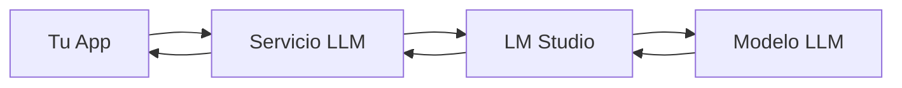

# 📚 Documentación - Servicio LLM

Bienvenido a la documentación completa del **Servicio LLM**. Un microservicio REST robusto para integrar modelos de lenguaje grandes en tus aplicaciones.

## 🎯 ¿Qué es el Servicio LLM?

Un microservicio **production-ready** que proporciona:
- ✅ **API REST simple** para interactuar con LLMs
- ✅ **Manejo robusto de errores** y reintentos automáticos
- ✅ **Validación de entrada** con Pydantic
- ✅ **Logging estructurado** para debugging
- ✅ **Rate limiting** y seguridad incorporada
- ✅ **Health checks** para monitoreo
- ✅ **Tests comprehensivos** (unitarios + integración)

## 📖 Guías de Documentación

### 🚀 **Para Empezar Rápido**
- **[Quick Start](QUICK_START.md)** - ¡De 0 a funcionando en 5 minutos!

### 🔧 **Para Desarrolladores**
- **[Guía de Integración](INTEGRATION_GUIDE.md)** - Documentación completa para integrar en tu proyecto
- **[Ejemplos de API](API_EXAMPLES.md)** - Casos de uso específicos con código completo

### 📋 **Para Administradores**
- **[README Principal](../README.md)** - Configuración, deployment y troubleshooting

## 🎯 Casos de Uso Típicos

### 🤖 **Chatbots y Asistentes**
```python
# Crear un chatbot en 3 líneas
import requests
response = requests.post("http://localhost:8000/llm/message", json={
    "model": "tu-modelo",
    "messages": [{"role": "user", "content": "¡Hola!"}]
})
print(response.json()["response"])
```

### 📝 **Generación de Contenido**
```python
# Generar un blog post
response = requests.post("http://localhost:8000/llm/message", json={
    "model": "tu-modelo",
    "messages": [{"role": "user", "content": "Escribe un post sobre IA"}],
    "temperature": 0.7,
    "max_tokens": 300
})
```

### 🧠 **Análisis de Texto**
```python
# Analizar sentimiento
response = requests.post("http://localhost:8000/llm/message", json={
    "model": "tu-modelo", 
    "messages": [{"role": "user", "content": "Analiza el sentimiento: Me encanta este producto"}]
})
```

### 💻 **Asistente de Código**
```python
# Explicar código
code = "def fibonacci(n): return n if n<=1 else fibonacci(n-1)+fibonacci(n-2)"
response = requests.post("http://localhost:8000/llm/message", json={
    "model": "tu-modelo",
    "messages": [{"role": "user", "content": f"Explica este código: {code}"}]
})
```

## 🌟 Características Principales

### 🔒 **Seguridad y Confiabilidad**
- Rate limiting configurable
- Headers de seguridad automáticos
- Validación estricta de entrada
- Manejo granular de errores
- Timeouts y reintentos automáticos

### 📊 **Observabilidad**
- Logging estructurado en JSON
- Correlation IDs para tracking
- Métricas de performance
- Health checks para monitoreo

### ⚡ **Performance**
- Connection pooling
- Caching opcional
- Procesamiento asíncrono
- Optimizaciones de producción

### 🧪 **Testing**
- Tests unitarios completos
- Tests de integración
- Tests con LLM real
- Scripts de validación manual

## 📊 Endpoints Disponibles

| Endpoint | Método | Descripción |
|----------|--------|-------------|
| `/` | GET | Información del servicio |
| `/health` | GET | Estado de salud y conectividad |
| `/llm/message` | POST | **Enviar mensaje al LLM** |
| `/docs` | GET | Documentación automática |

## 🚀 Flujo de Integración Típico



1. **Tu aplicación** envía una petición HTTP POST a `/llm/message`
2. **Servicio LLM** valida, procesa y reenvía a LM Studio
3. **LM Studio** ejecuta el modelo y devuelve la respuesta
4. **Servicio LLM** procesa y devuelve la respuesta estructurada

## 🎨 Ejemplos de Integración

### Python
```python
import requests

def ask_llm(question):
    response = requests.post("http://localhost:8000/llm/message", json={
        "model": "tu-modelo",
        "messages": [{"role": "user", "content": question}]
    })
    return response.json()["response"]

answer = ask_llm("¿Qué es machine learning?")
```

### JavaScript (Node.js)
```javascript
const axios = require('axios');

async function askLLM(question) {
    const response = await axios.post('http://localhost:8000/llm/message', {
        model: 'tu-modelo',
        messages: [{role: 'user', content: question}]
    });
    return response.data.response;
}

askLLM('¿Qué es JavaScript?').then(console.log);
```

### JavaScript (Frontend)
```javascript
async function askLLM(question) {
    const response = await fetch('http://localhost:8000/llm/message', {
        method: 'POST',
        headers: {'Content-Type': 'application/json'},
        body: JSON.stringify({
            model: 'tu-modelo',
            messages: [{role: 'user', content: question}]
        })
    });
    const data = await response.json();
    return data.response;
}
```

### cURL
```bash
curl -X POST "http://localhost:8000/llm/message" \
  -H "Content-Type: application/json" \
  -d '{
    "model": "tu-modelo",
    "messages": [{"role": "user", "content": "¡Hola!"}],
    "temperature": 0.7,
    "max_tokens": 100
  }'
```

## 🛠️ Configuración Rápida

### 1. Pre-requisitos
```bash
# Verificar LM Studio
curl http://localhost:1234/v1/models
```

### 2. Instalación
```bash
git clone <repo-url>
cd llm-service
pip install -r requirements.txt
```

### 3. Arrancar Servicio
```bash
uvicorn app.main:app --reload
```

### 4. Verificar
```bash
curl http://localhost:8000/health
```

## 📈 Monitoreo y Debugging

### Health Check
```bash
curl http://localhost:8000/health
# Respuesta:
{
  "status": "healthy",
  "llm_service": "connected", 
  "uptime": 3600,
  "version": "1.0.0"
}
```

### Headers Útiles
Cada respuesta incluye:
- `X-Correlation-ID`: Para tracking de peticiones
- `X-Process-Time`: Tiempo de procesamiento
- Headers de seguridad estándar

### Logging
```bash
# Logs estructurados en JSON
{"timestamp": "2024-01-01T12:00:00", "level": "INFO", "correlation_id": "abc-123", "message": "Petición completada"}
```

## 🚨 Solución de Problemas

### Errores Comunes

| Error | Causa | Solución |
|-------|-------|----------|
| Connection refused | Servicio no corriendo | `uvicorn app.main:app --reload` |
| Service unavailable (503) | LM Studio desconectado | Verificar LM Studio + modelo cargado |
| Request timeout (408) | Petición muy larga | Reducir `max_tokens` |
| Rate limit (429) | Demasiadas peticiones | Esperar y reintentar |

### Scripts de Diagnóstico
```bash
# Verificar conectividad LLM
python scripts/test_llm_connection.py

# Probar API completa
python scripts/test_api_manual.py

# Tests automatizados
make test-real  # Con LLM real
make test       # Solo mocks
```

## 🎯 Próximos Pasos

### 👶 **Si eres nuevo:**
1. **[Quick Start](QUICK_START.md)** - Tu primera integración en 5 minutos
2. Probar los ejemplos básicos
3. Experimentar con diferentes parámetros

### 🧑‍💻 **Si eres desarrollador:**
1. **[Guía de Integración](INTEGRATION_GUIDE.md)** - Documentación completa
2. **[Ejemplos de API](API_EXAMPLES.md)** - Casos de uso específicos
3. Implementar manejo de errores robusto

### 🏗️ **Si vas a producción:**
1. Configurar variables de entorno
2. Implementar caching y connection pooling
3. Configurar monitoreo y alertas
4. Leer sección de optimización

## 🤝 Soporte

- **Documentación API**: `http://localhost:8000/docs`
- **Health Check**: `http://localhost:8000/health`
- **Scripts de Testing**: `scripts/`
- **Configuración**: `.env.example`

---

**¡Comienza tu integración con LLM ahora!** 🚀

**[👉 Quick Start - ¡Empezar en 5 minutos!](QUICK_START.md)**