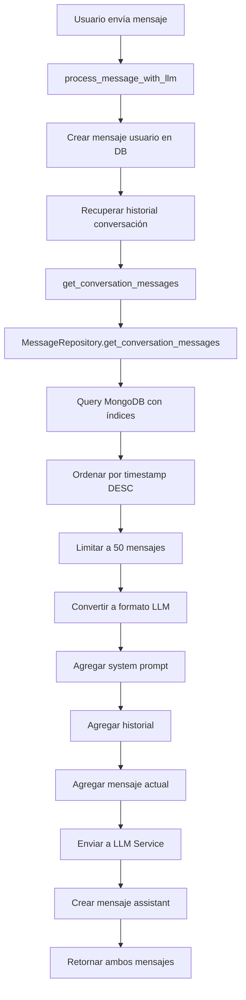

# Memory Retrieval - Guía de Funcionamiento

## 🧠 Memory Retrieval - Flujo Completo

### 1. **Punto de Entrada** (`process_message_with_llm`)
```python
# app/services/message_service.py:107-135
async def process_message_with_llm(
    self,
    request: CreateMessageRequest,
    user_id: str,
    character_id: Optional[str] = None,
    system_prompt: Optional[str] = None,
    model: Optional[str] = None,
    temperature: Optional[float] = None
)
```

### 2. **Construcción del Contexto LLM**
El sistema construye la memoria en **3 capas**:

#### **Capa 1: System Prompt** (líneas 136-138)
```python
llm_messages = []
if system_prompt:
    llm_messages.append(LLMMessage("system", system_prompt))
```

#### **Capa 2: Recuperación del Historial** (líneas 141-156)
```python
try:
    conversation_messages = await self.get_conversation_messages(
        conversation_id=request.conversation_id,
        request=ConversationMessagesRequest(limit=50)  # 🔥 Últimos 50 mensajes
    )
    
    # Convierte mensajes a formato LLM (excluyendo el actual)
    for msg in conversation_messages[:-1]:
        role = "user" if msg.role == MessageRole.USER else "assistant"
        llm_messages.append(LLMMessage(role, msg.content["text"]))
        
    logger.info(
        "Added conversation history",
        conversation_id=request.conversation_id,
        history_count=len(conversation_messages) - 1
    )
```

#### **Capa 3: Mensaje Actual** (línea 165)
```python
llm_messages.append(LLMMessage("user", request.content))
```

### 3. **Recuperación de Base de Datos** (`get_conversation_messages`)

#### **En MessageService** (líneas 66-88):
```python
async def get_conversation_messages(
    self,
    conversation_id: str,
    request: ConversationMessagesRequest
) -> List[MessageResponse]:
    
    messages = await self.repository.get_conversation_messages(
        conversation_id=conversation_id,
        limit=request.limit,           # 50 mensajes
        skip=0,                        # Sin paginación aún
        role=request.role,             # Filtro por rol (opcional)
        start_date=request.start_date, # Filtro fecha inicio
        end_date=request.end_date,     # Filtro fecha fin
        include_archived=request.include_archived
    )
```

#### **En MessageRepository** (líneas 50-89):
```python
async def get_conversation_messages(
    self,
    conversation_id: str,
    limit: int = 50,
    skip: int = 0,
    role: Optional[MessageRole] = None,
    start_date: Optional[datetime] = None,
    end_date: Optional[datetime] = None,
    include_archived: bool = False
) -> List[Message]:
    
    # 🔍 Construcción de query MongoDB
    query = Message.conversation_id == conversation_id
    
    if role:
        query = query & (Message.role == role.value)
    
    if start_date:
        query = query & (Message.timestamps['created_at'] >= start_date)
    if end_date:
        query = query & (Message.timestamps['created_at'] <= end_date)
    
    # 🚀 Ejecución optimizada con índices
    messages = await Message.find(query)\
        .sort(-Message.timestamps['created_at'])\  # Más recientes primero
        .skip(skip)\
        .limit(limit)\
        .to_list()
```

### 4. **Optimizaciones de Performance**

#### **Índices MongoDB** (database.py:66-73):
```python
class Settings:
    name = "messages"
    indexes = [
        "message_id",
        "conversation_id",
        "user_id",
        [("conversation_id", 1), ("timestamps.created_at", -1)],  # 🎯 Clave para memory retrieval
        [("user_id", 1), ("timestamps.created_at", -1)],
        [("timestamps.created_at", -1)],
    ]
```

#### **Estructura de Datos Optimizada**:
```python
class Message(Document):
    # Índices para búsqueda rápida
    message_id: Indexed(str)
    conversation_id: Indexed(str)  # 🔑 Clave para agrupación
    user_id: Indexed(str)
    
    # Contenido flexible
    content: Dict[str, Any] = Field(default_factory=dict)
    role: str = Field(pattern="^(user|assistant|system)$")
    
    # Timestamps para ordenamiento
    timestamps: Dict[str, Any] = Field(default_factory=dict)
```

### 5. **Manejo Robusto de Errores**

```python
try:
    # Recuperación de memoria
    conversation_messages = await self.get_conversation_messages(...)
except Exception as e:
    logger.warning(
        "Failed to get conversation history, proceeding without context",
        conversation_id=request.conversation_id,
        error=str(e)
    )
    # 🛡️ Continúa sin contexto si falla
```

### 6. **Formato Final para LLM**

El contexto se envía a la LLM como:
```python
[
    {"role": "system", "content": "Eres un asistente..."},
    {"role": "user", "content": "Mensaje del usuario 1"},
    {"role": "assistant", "content": "Respuesta del asistente 1"},
    {"role": "user", "content": "Mensaje del usuario 2"},
    {"role": "assistant", "content": "Respuesta del asistente 2"},
    # ... hasta 50 mensajes
    {"role": "user", "content": "Mensaje actual"}
]
```

## 🎯 Características Clave del Memory Retrieval:

1. **Límite Inteligente**: 50 mensajes para balance entre contexto y performance
2. **Orden Cronológico**: Más recientes primero, luego se reordena para LLM
3. **Filtrado Avanzado**: Por rol, fechas, estado de archivo
4. **Tolerancia a Fallos**: Continúa sin contexto si hay errores
5. **Logging Detallado**: Trazabilidad completa del proceso
6. **Optimización MongoDB**: Índices específicos para consultas rápidas
7. **Flexibilidad**: Soporte para diferentes tipos de contenido

## 📊 Flujo de Datos Completo



## 🔧 Configuración y Parámetros

### Parámetros Configurables:
- **Límite de mensajes**: 50 (línea 144 en message_service.py)
- **Timeout de consulta**: Configurado en settings
- **Índices MongoDB**: Automáticos via Beanie
- **Manejo de errores**: Graceful degradation

### Variables de Entorno Relevantes:
```bash
MONGODB_URL=mongodb://localhost:27017
MONGODB_DATABASE=message_service_dev
DEFAULT_MODEL=google/gemma-3-12b
MAX_TOKENS_PER_REQUEST=2048
```

Esta arquitectura asegura que la LLM siempre tenga el contexto necesario para mantener conversaciones coherentes y personalizadas.